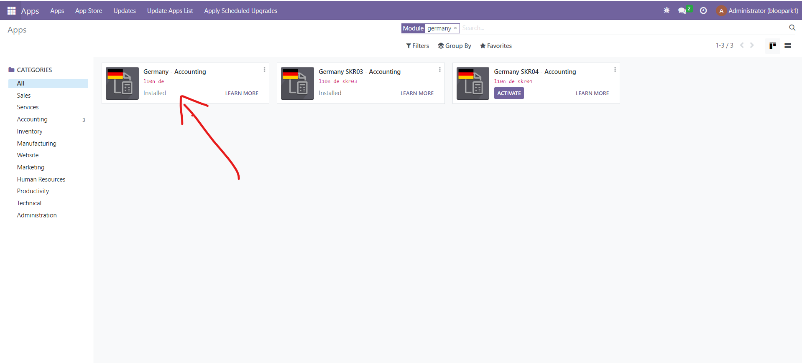
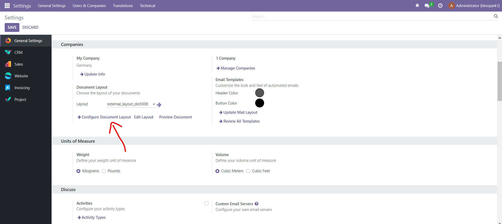
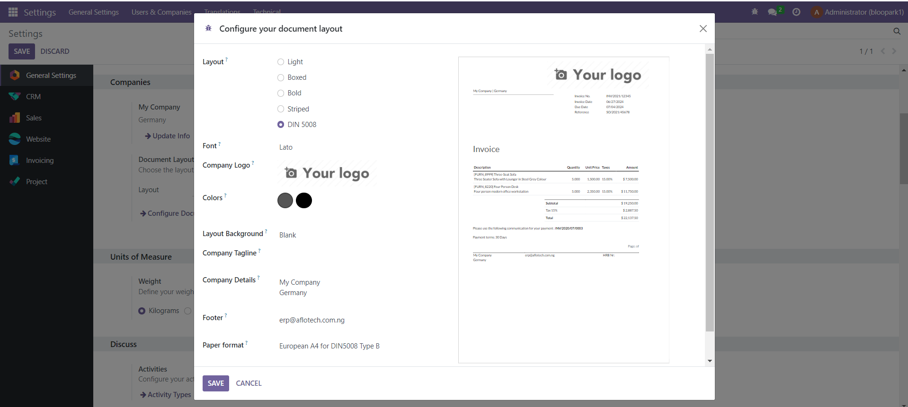
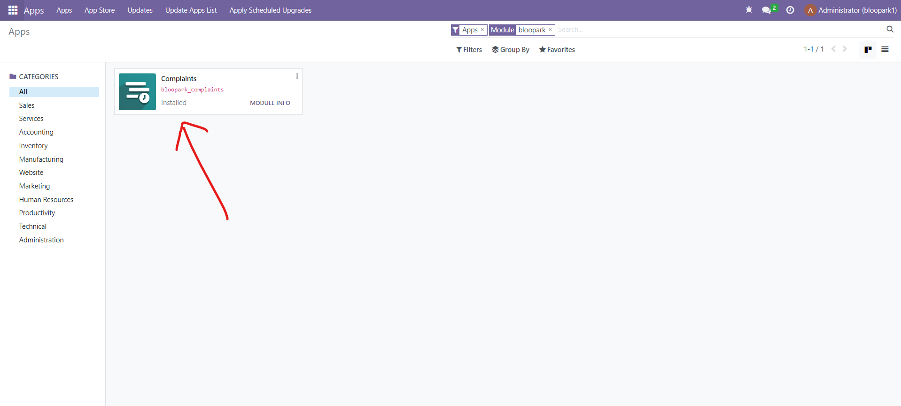
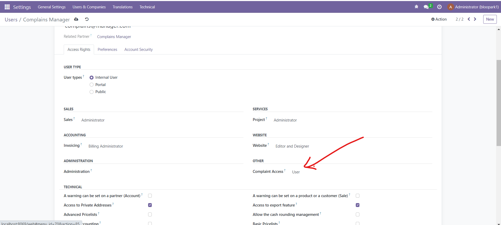

# bloopark
"RealEstateX Website complaint system

## Installation Steps

This module can work on any Odoo v16 database. You can pull the code on Git at:

```text
https://github.com/hafiz9w1/bloopark
```

## Install the German accounting chart and localization.

Install the German accounting chart and localization to use the DIN5008 standard.

Go to Menu - Apps - l10n_de




## Activate DIN5008

Install the German accounting chart and localization to use the DIN5008 standard.

Go to Menu - Settings - General Settings - Configure Document Layout - select DIN 5008




## Install the bloopark_complaints module

To install the module:

Go to Menu - Apps - bloopark_complaints



## Grant your user account access to the bloopark_complaints module

To grant your account access to the module:

Go to Menu - Settings - Users & Companies - Users - Select the user

